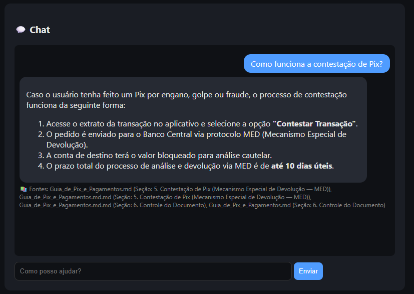
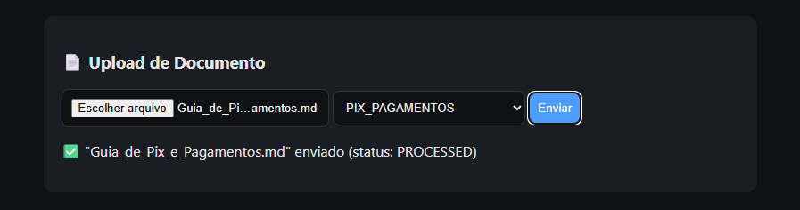
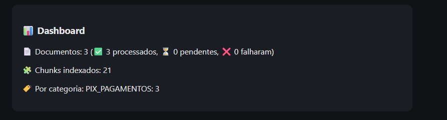

# 🤖 NB Assistant

**Conhecimento corporativo, respostas confiáveis.**

Assistente de IA corporativo baseado em **RAG (Retrieval-Augmented Generation)**, desenvolvido para a **NB.CASH** — fintech fictícia de contas digitais para crianças, adolescentes e jovens adultos — como parte do desafio **Alura Agentes**.

## 📋 Sobre o projeto

A NB.CASH possui diversos documentos internos (manuais, políticas e guias) distribuídos entre diferentes áreas, dificultando o acesso rápido às informações.

O **NB Assistant** permite que colaboradores façam perguntas em linguagem natural e recebam respostas objetivas, fundamentadas nos documentos corporativos indexados e acompanhadas das fontes utilizadas.

Quando a informação necessária não está disponível no contexto recuperado, o assistente informa que não encontrou evidências suficientes em vez de simplesmente inventar uma resposta.

## 🚀 Demo — rodando na OCI

🌐 **Aplicação:** http://163.176.185.227:8080

## Exemplos de Perguntas e Respostas

O NB Assistant responde perguntas em linguagem natural com base nos documentos corporativos.

**Exemplos de perguntas:**

- Como funciona a contestação de uma transação Pix?
- Qual é o público da modalidade Conta Kids?
- Quais são os limites do Pix por faixa etária?
- Quais são os procedimentos de segurança e prevenção à fraude?
- Como funciona o bloqueio de uma conta?

**Exemplos de respostas geradas:**

> **Pergunta:** Como funciona a contestação de uma transação Pix?  
> **Resposta:** O usuário pode iniciar a contestação pelo extrato da transação, selecionar...  
> **Fonte:** Guia_de_Pix_e_Pagamentos.md - Seção: Contestação de Pix

> **Pergunta:** Qual é o público da modalidade Conta Kids?  
> **Resposta:** A modalidade Kids é destinada a crianças de 8 a 12 anos.  
> **Fonte:** Documento corporativo indexado pelo NB Assistant.

### 💬 Chat com RAG e fontes

<p align="center">
  
</p>

<p align="center">
  <em>Pergunta em linguagem natural, resposta fundamentada e fontes recuperadas pelo RAG.</em>
</p>

### 📄 Upload de documento

<p align="center">
  
</p>

<p align="center">
  <em>Upload de documento com classificação e status de processamento.</em>
</p>

### 📊 Dashboard

<p align="center">
  
</p>

<p align="center">
  <em>Monitoramento de documentos processados, chunks indexados e categorias.</em>
</p>

## 🏗️ Arquitetura

```text
Usuário
   ↓
Frontend (Thymeleaf)
   ↓
Spring Boot REST API
   ├───────────────────────┬─────────────────────────┐
   ↓                       ↓                         ↓
UploadController      ChatController         DashboardController
   ↓                       ↓                         ↓
UploadService          RagService             DashboardService
   ↓                       ↓
StorageService         Busca semântica
   ↓                       ↓
OCI Object Storage    PostgreSQL + pgvector
   │                       ↑
   └──────────────┐        │
                  ↓        │
             IngestionService
                  ↓
             ParserFactory
                  ↓
        ┌─────────┼──────────┬──────────┐
        ↓         ↓          ↓          ↓
      Parser    Parser     Parser     Parser
        ↓
   ParsedDocument
        ↓
   ChunkService
        ↓
   EmbeddingService
        ↓
     PGVector
        ↓
     Gemini
        ↓
Resposta + fontes
```

## 🔄 Pipeline RAG

```text
Upload
  ↓
Storage
  ↓
Parser Factory
  ↓
Extração
  ↓
Chunking
  ↓
Embeddings
  ↓
PGVector
  ↓
Busca semântica
  ↓
Contexto recuperado
  ↓
Google Gemini
  ↓
Resposta
  ↓
Fontes
```

## 🛠️ Stack tecnológica

| Camada | Tecnologia |
|---|---|
| Backend | Java 21, Spring Boot 3.5.5, Maven |
| IA | Spring AI 1.1.0, Google Gemini |
| Modelo de chat | `gemini-2.5-flash` |
| Embeddings | `gemini-embedding-2` |
| Banco | PostgreSQL + pgvector |
| Frontend | Thymeleaf, HTML, CSS, JavaScript |
| Containers | Docker / Podman |
| Cloud | Oracle Cloud Infrastructure (OCI Compute) |
| Storage | OCI Object Storage + fallback/local |

## ✨ Funcionalidades

### 📄 Upload e ingestão

- Upload via `MultipartFile`
- Classificação por categoria
- Persistência dos metadados do documento
- Status de processamento:
  - `PENDING`
  - `PROCESSING`
  - `PROCESSED`
  - `FAILED`
- Registro do motivo da falha
- Storage com OCI Object Storage e fallback/local

### 🧩 Parsers

O pipeline utiliza `DocumentParser` + `ParserFactory`, permitindo adicionar novos formatos sem alterar o restante da ingestão.

**Formatos validados no ambiente de produção:**

- ✅ PDF
- ✅ DOCX
- ✅ CSV
- ✅ Markdown

**Parsers implementados no código e pendentes de validação no ambiente OCI:**

- ⚠️ XLSX
- ⚠️ PPTX
- ⚠️ HTML
- ⚠️ JSON

> A implementação desses quatro parsers está presente no projeto, mas a versão publicada na OCI ainda não foi validada com eles.

### 💬 Chat corporativo

- Interface de chat baseada em Thymeleaf
- Perguntas em linguagem natural
- RAG com busca semântica
- Respostas fundamentadas no contexto recuperado
- Citação de fontes
- Histórico temporário por sessão usando `chatId`
- Memória de contexto com Spring AI
- Renderização de Markdown
- Fallback quando não existe informação suficiente

### 📚 Fontes

Cada resposta pode apresentar:

- documento utilizado;
- página, slide, parágrafo ou seção;
- `similarityScore` como indicador de relevância.

### 📊 Dashboard

O dashboard disponibiliza informações sobre:

- total de documentos;
- documentos processados;
- documentos falhos;
- documentos pendentes/em processamento;
- total de chunks;
- distribuição de documentos por categoria.

> As métricas de embeddings armazenados e perguntas realizadas ainda precisam ser confirmadas na versão final do dashboard.

## 🗂️ Categorias de documentos

- 👥 Recursos Humanos
- 💳 Produtos Financeiros
- 👨‍👩‍👧 Contas Kids e Teen
- ⚖️ Compliance
- 🔐 Segurança
- 🛡️ Prevenção à Fraude
- 📱 Pix e Pagamentos
- 📞 Atendimento
- 🧑‍💻 Tecnologia e APIs
- 📢 Marketing
- ⚙️ Operações

## 🧠 Memória de conversa

Cada carregamento da interface gera um `chatId` com `crypto.randomUUID()`.

Esse identificador é enviado junto às perguntas e utilizado pelo Spring AI para manter o contexto temporário da conversa.

Com isso, perguntas de acompanhamento podem utilizar o histórico da mesma sessão.

Ao recarregar a página, uma nova sessão é iniciada.

## 🧱 Decisões de arquitetura

### Strategy Pattern para parsers

A abstração:

```text
DocumentParser
       ↓
ParserFactory
       ↓
Parser específico
```

permite adicionar novos formatos sem alterar o pipeline principal de ingestão.

### Pipeline de ingestão isolado

O `IngestionService` orquestra:

```text
extração
  ↓
chunking
  ↓
embedding
  ↓
indexação
```

e mantém o status do documento durante o processamento.

### Sem entidade `DocumentChunk`

Os chunks e seus vetores são mantidos no `VectorStore` do Spring AI (`vector_store`) em vez de duplicar o conteúdo em uma tabela adicional.

### Abstração de Storage

O `StorageService` desacopla o armazenamento do restante da aplicação, permitindo utilizar OCI Object Storage ou storage local.

## 🌐 API

### Upload

```http
POST /api/documents/upload
Content-Type: multipart/form-data
```

Campos:

```text
file
category
```

### Chat

```http
POST /api/chat
Content-Type: application/json
```

Exemplo:

```json
{
  "question": "Qual é o objetivo da Conta Kids?",
  "chatId": "uuid-da-sessao"
}
```

### Dashboard

```http
GET /api/dashboard
```

### Endpoint de teste

```http
GET /api/test
```

## 🏃 Como rodar localmente

### Pré-requisitos

- Java 21
- Docker/Podman
- PostgreSQL + pgvector
- Chave da API Gemini

### 1. Clone o repositório

```bash
git clone https://github.com/PettersonnOliveira/nb-assistant.git
cd nb-assistant
```

### 2. Configure a chave do Gemini

Linux/macOS:

```bash
export GEMINI_API_KEY=sua-chave-aqui
```

PowerShell:

```powershell
$env:GEMINI_API_KEY="sua-chave-aqui"
```

### 3. Suba a infraestrutura

```bash
docker compose up -d
```

### 4. Execute a aplicação

Linux/macOS:

```bash
./mvnw spring-boot:run
```

Windows:

```powershell
.\mvnw.cmd spring-boot:run
```

Acesse:

```text
http://localhost:8080
```

## ☁️ Deploy na OCI

A aplicação está publicada em uma **OCI Compute Instance com Oracle Linux 9**.

Ambiente de produção:

```text
Oracle Cloud Infrastructure
        ↓
Compute Instance
        ↓
Podman rootless
        ├── NB Assistant
        └── PostgreSQL + pgvector
```

Também foram tratados problemas específicos do ambiente OCI/Oracle Linux, incluindo:

- versão incorreta do SDK OCI Object Storage;
- regra de ingress da Security List;
- porta 8080 no `firewalld`;
- permissões de `storage-local` com SELinux em modo Enforcing;
- uso do sufixo `:Z` nos volumes;
- execução concorrente de `podman-compose`.

## 🔒 Configuração e segurança

A API key do Gemini não deve ser versionada no repositório.

A aplicação utiliza variável de ambiente:

```properties
spring.ai.google.genai.api-key=${GEMINI_API_KEY}
```

Mantenha segredos e credenciais fora do Git.

## 🧪 Estado do MVP

### ✅ Núcleo concluído

- Spring Boot + Java 21
- PostgreSQL + pgvector
- Gemini
- Upload
- Storage
- Parsing
- Chunking
- Embeddings
- Busca semântica
- RAG
- Fontes
- Chat
- Memória temporária de sessão
- Dashboard
- OCI
- Deploy público

### ⚠️ Pendências conhecidas

**Formatos implementados no código, mas ainda pendentes de validação em produção na OCI:**
- confirmação/ajuste das métricas de embeddings e perguntas no dashboard;

## 📌 Limitações atuais

O projeto foi construído como um MVP do desafio. Algumas funcionalidades que não fazem parte do escopo obrigatório podem ser evoluídas posteriormente, como autenticação completa, autorização por usuário/departamento, persistência permanente do histórico e observabilidade avançada.

## 👤 Autor

Desenvolvido por [Petterson Oliveira](https://github.com/PettersonnOliveira) como parte do desafio **Alura Agentes**.
